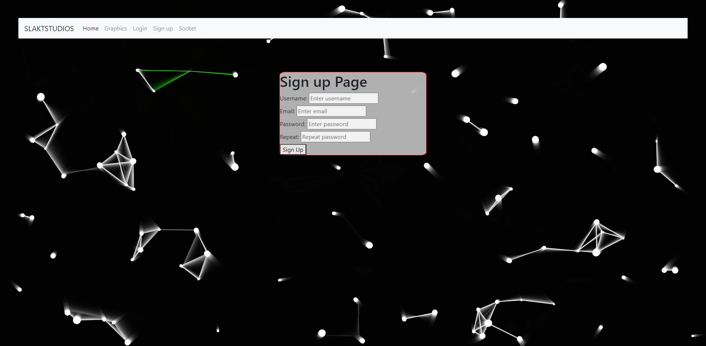
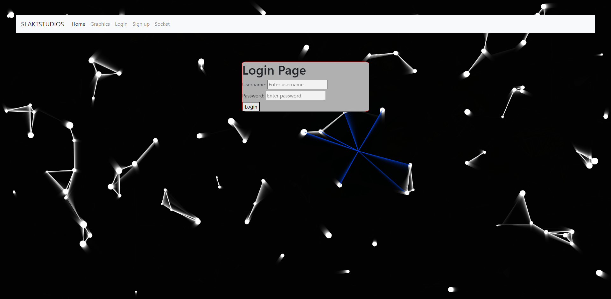
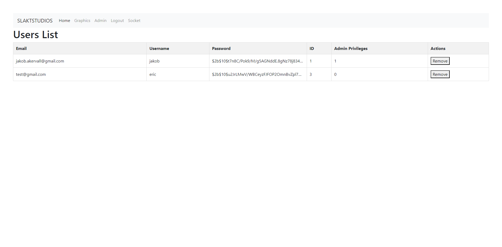
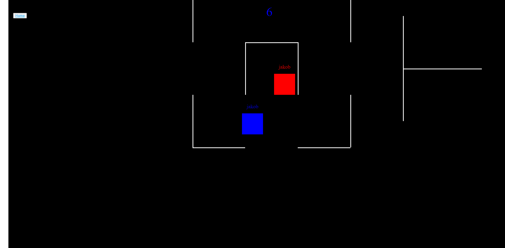
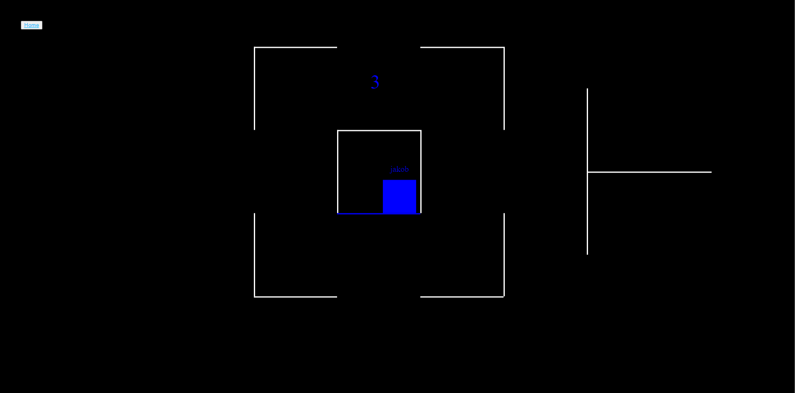

# HideNSeek webgame

## Description

A multiplayer Hide And Seek game using socketIo and Express. Webserver also has a sign-up, login and admin function. All visibility checks are managed clientside therefore meaning no Anticheat measures taken.

## Screenshots









### Notes

Game is not finished and Docker is not properly setup. Not tested for security.

## Getting Started

Follow these steps to set up and run the project locally.

### Prerequisites

- Node.js and npm (or Yarn) installed

### Installing Dependencies

Run the following command to install project dependencies:

```bash
npm install
# or
yarn install

